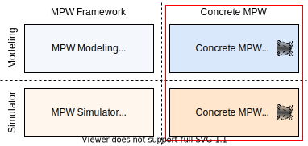
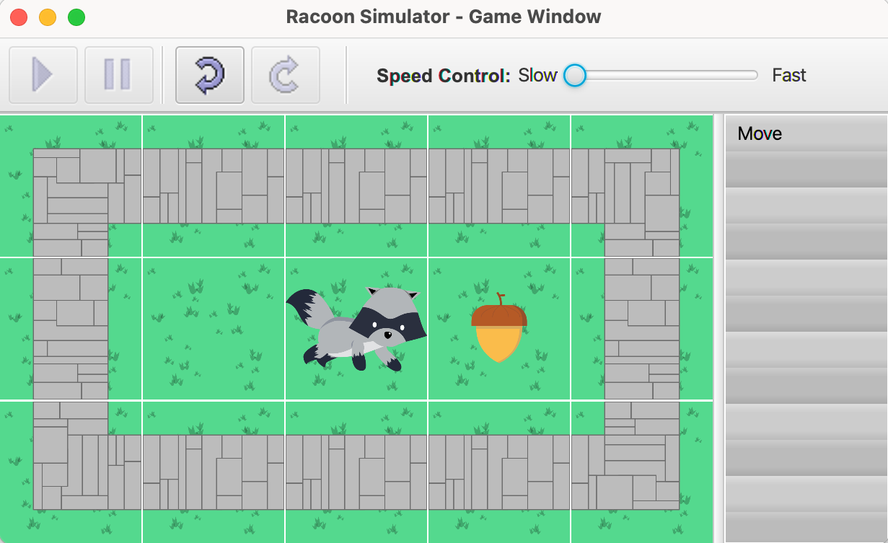

# Racoon - MPW Simulator

This is the modeled racoon MPW simulator example based on the MPW framework (https://github.com/Fumapps/mpw-modeling-framework).

It defines the modeling of the racoon simulator under `/bundles/de.unistuttgart.iste.sqa.mpw.modeling.racoonsimulator`.
After code-generation with Maven `package`, in `/simulators` the both simulators for Java and C++ can be found.

## Java Simulator

The Java simulator uses Maven, Java 15 and JavaFX.

##  C++ Simulator

The C++ simulator is based on CMake and SDL2.
